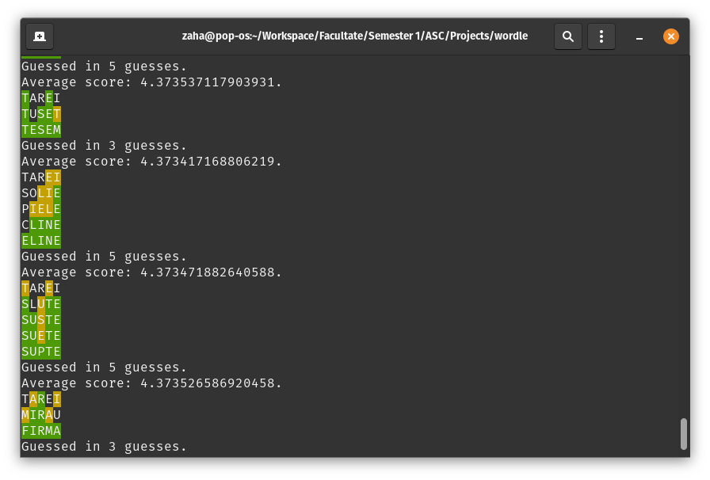
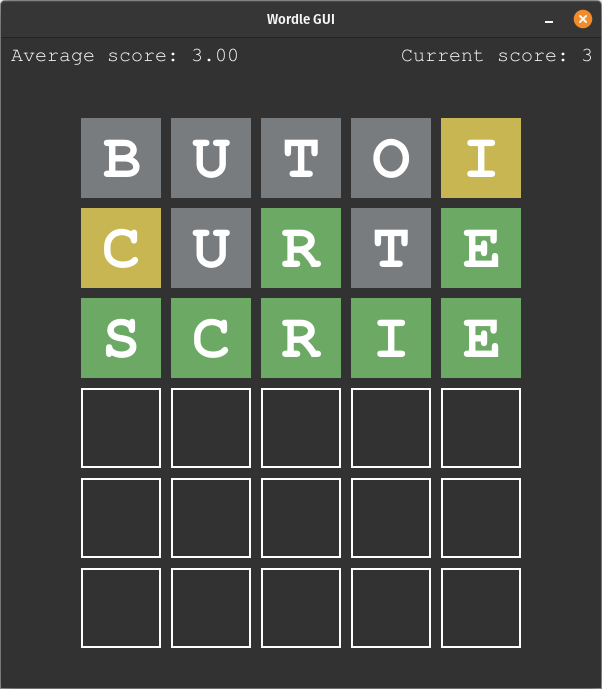

# Wordle Project for ASC course

This is a simple wordle game with a bot which automatically solves it.

## Authors

- [Zaharie Stefan-Florin](https://www.github.com/oxygen-consumer)
- [Gagauta Andrei-Paul](https://github.com/emtu5)
- [Terenti Mihai](https://github.com/MITE666)


## Running

To run this project you need to have python 3.10+ and install packages from requirements.txt like so:

```bash
  python -m pip install -r requirements.txt
```

You can run it with the bot using:
```bash
  python main.py
```
or if you want to play the game yourself use:
```bash
  python main.py --human
```
## Extra features

- GUI and a better wordlist for human players
- average guess rate of the bot is about 4.37

## Documentation

The project structure is a three layer arhitecture.

In Repository folder we have two repositories, one for the bot provided by the teacher, and one taken from wordle.ro for a more sane wordlist for human players.

In Logic folder we have the bot and the game service.

In Controller we have two UIs, a CLI used to display the bot progress and a GUI written in pygame used for playing as a human.

The bot uses [buggy behaviour](https://youtu.be/fRed0Xmc2Wg?t=30) as requested, but for the human player we took the extra step to provide a buggy free feedback.

The bot is being run via a child process form the bot handler class which can be found in the Controller folder.
For communication with the bot we used two Queue objects from default multiprocessing module. One for output, one for input.

## Screenshots



